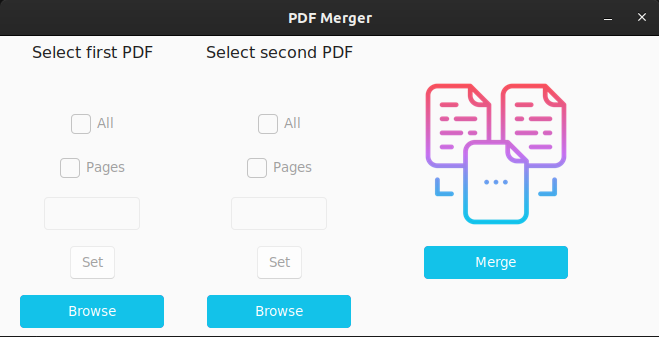

## PDF Merger
App with basic merge functionality of two PDFs, possible selecting whole PDF or custom range.

Implemented https://github.com/rdbende/Sun-Valley-ttk-theme with slight color modifications in light variant as main theme. 
There is possibility to change into dark mode by rewriting following line in `PDF_merger.py` 
`widget.tk.call("set_theme", "light")` into `widget.tk.call("set_theme", "dark")`.

## Quick start
1. Install all dependencies in virtual environment `pipenv install`
2. Run virtual environment `pipenv shell`
3. `python3 -m PDF_merger`

## Create executable
1. `pyinstaller PDFMerger.spec`

## License
[MIT License](LICENSE)
